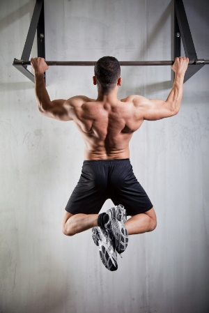

    

-----------------
# Overview
Core Control represents a new generation of fitness apps where your ultimate potential is unleashed through computer vision. 
https://github.com/CMU-Perceptual-Computing-Lab/openpose/blob/master/doc/output.md#keypoint-ordering-in-c-python
Workflow: 
=======
## Workflow/App lifecycle
App -> user: Display start button to start game
   ### Loop
    App -> GPU: Stream images to server
    GPU -> App: message ("LED Kicked" or "LED not kicked")
    App -> Board: tell board via bluetooth to switch off current LED and switch on new LED
    App -> GPU: If Last kick stop sending video and ask gpu for form analysis
    GPU -> App: Receive form analysis
    App -> user: Display form analysis to user + wait for user to start game again (game start button)

## Features
- **Functionality**:
    - **2D real-time multi-person keypoint detection and tracking**:
        - Using openpose
- **Input**: Image, video
- **Output**: Basic image + keypoint display/saving (PNG, JPG, AVI, ...), keypoint saving (JSON, XML, YML, ...), and/or keypoints as array class.

## Installation
See [Openpose](https://github.com/CMU-Perceptual-Computing-Lab/openpose/)
